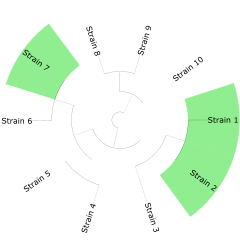
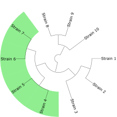

# PaReBrick (Parallel Rearrangement and Breakpoints)

---
## Project goals
Bacterial genomes are remarkably plastic on the evolutionary time scale, and genomic rearrangements such as inversions, deletions, insertions, and duplications independently occur in the genomes of different strains, which may serve a mechanism of the adaptation to changing environmental conditions. 
Identification of these events requires laborious manual inspection and verification of the phyletic pattern consistency. 
Thus, the main goal of this project is identification and description of parallel rearrangements occurring in bacterial genomes.

More strictly, our goal is to find characters which are non-convex on a phylogenetic tree, 
or in other words characters with homoplasy.
Homoplasy is when a character state has been gained independently in separate lineages over the course of evolution.
You can see an example of convex and non-convex characters below:

Non-convex character <br> (character with homoplasy) |  Convex character <br> (homoplasy-free character)
:-------------------------:|:-------------------------:
  |  

## Methods
This method takes synteny blocks and phylogenetic tree for some strains as input and 
Method consist of two main parts:
1. Constructing characters and them states (~colors of leaves) with synteny blocks:
    * Balanced rearrangements (focused in inversions) — search pattern in multiple breakpoint graph;
    * Unbalanced rearrangements — considered as copy number variation.
2. Checking convexity of constructed characters on a phylogenetic tree. 
Also counting "measure" of non-convexity for all non-convex characters and sort by its value.

For output size reduction and detection of phyletic patterns of blocks in unbalanced rearrangements case, character clustering is performed.

## Installation 

PaReBrick can be installed with `pip`:

```bash
pip install PaReBrick
```

Now you can run tool from any directory as `PaReBrick` (or `parebrick`).


## Script parameters
Main script of project including all modules together can be run from anywhere as console tool.

### Required input

**Important for input:** Identifiers in tree and on in blocks must be equal;

#### `--tree/t`
Tree in newick format, must be parsable by ete3 library.
You can read more about [formats supported by ete3](http://etetoolkit.org/docs/latest/tutorial/tutorial_trees.html#reading-and-writing-newick-trees)

#### `--blocks_folder/-b`
Path to folder with blocks resulted as output of original Sibelia or maf2synteny tool.

[BLOCKS-OBTAIN.md](BLOCKS-OBTAIN.md) — instruction about how to obtain synteny blocks using SibeliaZ.

### Optional input

#### `--labels/-l`
Path to csv file with tree labels for showing on phylogenetic tree. 
Must contain two columns: `strain` and `label`.

#### `--output/-o`
Path to output folder.
Default is `./parebrick_output`

### Output
Output consist of tree folders.
1. `preprocessed_data` — 
here you can find `blocks_coords.infercars` for better blocks representation and region annotation.
And `genomes_permutations_unique.txt` file used for calling balanced characters.
As well as same data but in `.csv` format for more convenient use.
2. `balanced_rearrangements_output` — this folder contains `stats.csv` file with all non-convex characters statistics of balanced rearrangements. 
And folders `characters`, `trees` with character representation in rendered `.pdf` tree and `.csv` formats.
3. `unbalanced_rearrangements_output` — this folder contains `stats.csv` file with all non-convex characters statistics of unbalanced rearrangements. 
And folders `characters`, `trees` with character in rendered `.pdf` tree and `.csv` formats in subfolders according to their clustering representation.


## Example run and data
Example data is available in `example-data` folder.

### How to run:
Clone all repository with data:
```bash
git clone https://github.com/ctlab/parallel-rearrangements
```

Change directory to data folder:
```bash
cd parallel-rearrangements/example-data/streptococcus_pyogenes/input
```

Running tool on example input:
```
PaReBrick -t tree.nwk -b maf2synteny-output -l labels.csv
```

Or with minimal required arguments (no labels):
```
PaReBrick -t tree.nwk -b maf2synteny-output
```
